# Ada Architecture Diagrams

## Complete System Architecture

```mermaid
graph TB
    subgraph "Frontend - Browser"
        UI[User Interface]
        VoiceRec[Voice Recognition<br/>Web Speech API]
        VoiceToggle[Voice Output Toggle]
        Settings[Agent Settings Modal]
    end
    
    subgraph "Frontend Services"
        AppJS[app.js<br/>Main Application]
        SocketIOService[GrokVoiceSocketIOService<br/>Socket.io Client]
        AudioCtx[AudioContext<br/>24kHz PCM]
    end
    
    subgraph "Backend - Node.js Server"
        SocketIOServer[Socket.io Server<br/>/api/analyst/socket.io]
        GrokProxy[GrokVoiceWebSocketProxy<br/>Singleton]
        ChatAPI[/api/agent/chat<br/>Text Chat]
        ChatEnhanced[/api/agent/chat-enhanced<br/>With Relationship Detection]
    end
    
    subgraph "Agent Intelligence Layer"
        RelationshipDet[RelationshipDetector<br/>9 Categories]
        ResponseBuilder[ResponseBuilder<br/>Context-Aware Responses]
        AgentComm[AgentCommunicationSystem<br/>Orchestrator]
        PermanentMem[PermanentMemory<br/>Redis + MongoDB]
        EmbeddingSvc[EmbeddingService<br/>OpenAI Embeddings]
    end
    
    subgraph "External APIs"
        GrokVoice[Grok Voice API<br/>wss://api.x.ai/v1/realtime]
        Claude[Anthropic Claude API<br/>Text Generation]
        OpenAI[OpenAI API<br/>Embeddings + GPT]
    end
    
    %% User Interactions
    UI -->|User Types Message| AppJS
    UI -->|Clicks Voice Toggle| VoiceToggle
    VoiceToggle -->|Sets Flag| AppJS
    VoiceRec -->|Speech → Text| AppJS
    Settings -->|Configures Flags| AppJS
    
    %% Frontend Flow
    AppJS -->|sendAgentMessage| ChatEnhanced
    AppJS -->|speakText| SocketIOService
    SocketIOService -->|grok-voice:text| SocketIOServer
    SocketIOService -->|Receives Audio| AudioCtx
    AudioCtx -->|Plays Sound| UI
    
    %% Backend Flow
    SocketIOServer -->|Forwards Messages| GrokProxy
    GrokProxy -->|Raw WebSocket| GrokVoice
    GrokVoice -->|Audio Chunks| GrokProxy
    GrokProxy -->|Forwards Audio| SocketIOServer
    SocketIOServer -->|grok-voice:audio| SocketIOService
    
    %% Chat Flow
    ChatEnhanced -->|useRelationshipDetection=true| AgentComm
    AgentComm -->|Detects Relationship| RelationshipDet
    RelationshipDet -->|Uses Embeddings| EmbeddingSvc
    EmbeddingSvc -->|API Call| OpenAI
    AgentComm -->|Builds Response| ResponseBuilder
    ResponseBuilder -->|Loads History| PermanentMem
    PermanentMem -->|Stores/Retrieves| Redis[(Redis)]
    PermanentMem -->|Persists| MongoDB[(MongoDB)]
    AgentComm -->|Generates Text| Claude
    ChatEnhanced -->|Returns Response| AppJS
    
    %% Session Configuration
    SocketIOServer -->|grok-voice:connect| GrokProxy
    GrokProxy -->|session.update| GrokVoice
    GrokVoice -->|session.updated| GrokProxy
    GrokProxy -->|grok-voice:connected| SocketIOServer
```

## Voice Flow Sequence

```mermaid
sequenceDiagram
    participant User
    participant UI as Frontend UI
    participant AppJS as app.js
    participant SocketIO as Socket.io Client
    participant Server as Socket.io Server
    participant Proxy as GrokVoiceProxy
    participant Grok as Grok Voice API
    
    Note over User,Grok: Voice Output Flow (TTS Mode)
    
    User->>UI: Types message or speaks
    UI->>AppJS: sendAgentMessage(message)
    AppJS->>Server: POST /api/agent/chat-enhanced
    Server->>Server: Relationship Detection<br/>(if enabled)
    Server->>Grok: Claude API Call<br/>(Text Generation)
    Grok-->>Server: Text Response
    Server-->>AppJS: {response: "Ada's response"}
    
    AppJS->>AppJS: Check: agentVoiceOutputEnabled?
    alt Voice Output Enabled
        AppJS->>AppJS: speakAgentResponse(text)
        AppJS->>SocketIO: speakText(cleanText)
        SocketIO->>Server: emit('grok-voice:text', {text})
        Server->>Proxy: sendToGrok(conversation.item.create)
        Proxy->>Grok: conversation.item.create<br/>{role: 'user', text: "..."}
        Note over Proxy,Grok: Wait 500ms
        Proxy->>Grok: response.create<br/>{modalities: ['audio', 'text']}
        Grok->>Proxy: response.output_audio.delta<br/>(Audio chunks - PCM base64)
        Proxy->>Server: Forward audio chunks
        Server->>SocketIO: emit('grok-voice:audio', {audio})
        SocketIO->>SocketIO: Convert PCM → Float32
        SocketIO->>UI: Play audio via Web Audio API
        UI->>User: 🔊 Ada speaks response
    else Voice Output Disabled
        AppJS->>UI: Display text only
    end
    
    Note over User,Grok: Session Configuration Flow
    
    SocketIO->>Server: emit('grok-voice:connect')
    Server->>Proxy: connectToGrok()
    Proxy->>Grok: WebSocket Connect
    Grok-->>Proxy: WebSocket Open
    Proxy->>Grok: session.update<br/>{instructions: "You are Ada...", voice: "eve"}
    Grok-->>Proxy: session.updated
    Proxy->>Server: emit('session-ready')
    Server->>SocketIO: emit('grok-voice:connected')
    SocketIO->>SocketIO: isConnected = true
```



## Simplified System Overview

```mermaid
graph LR
    subgraph "User Layer"
        U[User<br/>Aaron]
    end
    
    subgraph "Frontend Layer"
        UI[Browser UI]
        VRec[Voice Recognition]
        VTog[Voice Toggle]
    end
    
    subgraph "Application Layer"
        APP[app.js<br/>Main Controller]
        SIO[Socket.io Client]
    end
    
    subgraph "Backend API Layer"
        SIO_SRV[Socket.io Server]
        CHAT[/api/agent/chat]
        CHAT_ENH[/api/agent/chat-enhanced]
        PROXY[GrokVoiceProxy]
    end
    
    subgraph "Agent Intelligence"
        REL[Relationship<br/>Detector]
        RESP[Response<br/>Builder]
        MEM[Permanent<br/>Memory]
        EMB[Embedding<br/>Service]
    end
    
    subgraph "External Services"
        GROK_V[Grok Voice API<br/>TTS]
        CLAUDE[Claude API<br/>Text Gen]
        OPENAI[OpenAI API<br/>Embeddings]
    end
    
    subgraph "Storage"
        REDIS[(Redis<br/>Fast Cache)]
        MONGO[(MongoDB<br/>Persistent)]
    end
    
    %% User Flow
    U -->|Types/Speaks| UI
    UI -->|Sends Message| APP
    APP -->|Text Chat| CHAT_ENH
    APP -->|Voice Output| SIO
    
    %% Voice Flow
    SIO -->|Socket.io| SIO_SRV
    SIO_SRV -->|WebSocket| PROXY
    PROXY -->|Raw WebSocket| GROK_V
    GROK_V -->|Audio| PROXY
    PROXY -->|Audio| SIO_SRV
    SIO_SRV -->|Audio| SIO
    SIO -->|Plays| UI
    UI -->|Sound| U
    
    %% Intelligence Flow
    CHAT_ENH -->|If Enabled| REL
    REL -->|Uses| EMB
    EMB -->|Calls| OPENAI
    REL -->|Detects| RESP
    RESP -->|Loads| MEM
    MEM -->|Reads| REDIS
    MEM -->|Reads| MONGO
    RESP -->|Generates| CLAUDE
    CLAUDE -->|Text| CHAT_ENH
    CHAT_ENH -->|Response| APP
    APP -->|Displays| UI
    
    %% Configuration
    VTog -->|Toggles Flag| APP
    VRec -->|Speech Input| APP
```

## Key Components

### Frontend
- **app.js**: Main application controller
- **GrokVoiceSocketIOService**: Socket.io client for voice
- **AudioContext**: Web Audio API for playback

### Backend
- **Socket.io Server**: Handles frontend connections
- **GrokVoiceWebSocketProxy**: Singleton proxy to Grok API
- **Chat Endpoints**: `/api/agent/chat` and `/api/agent/chat-enhanced`

### Agent Intelligence
- **RelationshipDetector**: Analyzes conversation relationships (9 categories)
- **ResponseBuilder**: Creates context-aware responses
- **PermanentMemory**: Hybrid Redis/MongoDB storage
- **EmbeddingService**: Vector embeddings for semantic search

### External APIs
- **Grok Voice API**: Text-to-speech (Eve voice - British accent)
- **Claude API**: Text generation
- **OpenAI API**: Embeddings generation

## Data Flow

1. **User Input** → Frontend → Backend
2. **Relationship Detection** → Analyzes history → Enhances context
3. **Text Generation** → Claude API → Response
4. **Voice Output** → Socket.io → Grok Voice → Audio playback
5. **Memory Storage** → Redis (fast) + MongoDB (persistent)


