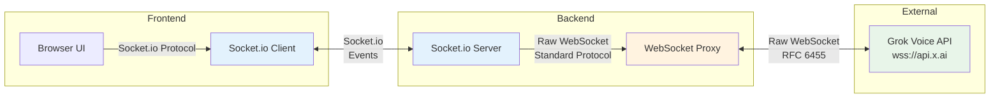

# Why We Use Raw WebSockets to Grok API (Not Socket.io)

## The Architecture

```
Frontend (Browser)
    ↓ Socket.io ← Our choice for frontend-backend
Backend (Node.js Server)
    ↓ Raw WebSocket ← Required for Grok API
Grok Voice API (wss://api.x.ai/v1/realtime)
```

## Key Reasons

### 1. **Grok API Only Supports Standard WebSocket Protocol**

The Grok Voice API (`wss://api.x.ai/v1/realtime`) expects **standard WebSocket protocol** messages, not Socket.io's custom protocol.

**Grok API expects:**
```json
{
  "type": "session.update",
  "session": { ... }
}
```

**Socket.io wraps messages like:**
```json
{
  "type": 2,  // Socket.io message type
  "nsp": "/",
  "data": ["event-name", { ... }]
}
```

Socket.io adds its own protocol layer that Grok doesn't understand.

### 2. **Protocol Incompatibility**

- **Socket.io** uses a custom binary protocol on top of WebSocket
- **Grok API** expects standard WebSocket text/binary frames
- They are **not compatible** - you cannot use Socket.io client to connect to a raw WebSocket server

### 3. **Performance for Audio Streaming**

Raw WebSockets provide:
- **Lower latency** - No protocol overhead
- **Direct binary support** - Audio chunks (PCM) can be sent/received efficiently
- **Minimal overhead** - Critical for real-time audio streaming

Socket.io adds:
- Protocol wrapping/unwrapping
- Event serialization
- Extra metadata per message
- **Higher latency** for audio streaming

### 4. **Interoperability**

- Raw WebSocket is a **standard protocol** (RFC 6455)
- Works with any WebSocket client/server in any language
- Grok API is language-agnostic - it doesn't care if you're using Node.js, Python, Go, etc.

Socket.io:
- Requires Socket.io client library
- Language-specific implementations
- Not compatible with standard WebSocket servers

### 5. **Our Hybrid Approach**

We use **both** technologies for different purposes:

```javascript
// Frontend ↔ Backend: Socket.io (convenient, feature-rich)
socket.emit('grok-voice:text', { text: 'Hello' });
socket.on('grok-voice:audio', (data) => { ... });

// Backend ↔ Grok API: Raw WebSocket (required, performant)
const grokWs = new WebSocket('wss://api.x.ai/v1/realtime', {
  headers: { 'Authorization': `Bearer ${apiKey}` }
});
grokWs.send(JSON.stringify({ type: 'session.update', ... }));
```

## Code Evidence

From `server.js` (line 7419):

```javascript
// We MUST use raw WebSocket - Grok API doesn't support Socket.io protocol
this.sharedGrokWs = new WebSocket('wss://api.x.ai/v1/realtime', {
  headers: {
    'Authorization': `Bearer ${this.grokApiKey}`
  }
});
```

From `js/grok-voice-socketio-service.js`:

```javascript
// Frontend uses Socket.io to communicate with OUR backend
socket.emit('grok-voice:text', { text: cleanText });
socket.on('grok-voice:audio', (data) => {
  // Handle audio from backend
});
```

## Why Not Socket.io for Grok Connection?

### ❌ Cannot Use Socket.io Client for Grok API

```javascript
// This WON'T work - Grok doesn't understand Socket.io protocol
const socket = io('wss://api.x.ai/v1/realtime');
socket.emit('session.update', { ... }); // ❌ Protocol mismatch
```

### ✅ Must Use Raw WebSocket

```javascript
// This WORKS - Standard WebSocket protocol
const ws = new WebSocket('wss://api.x.ai/v1/realtime', {
  headers: { 'Authorization': `Bearer ${key}` }
});
ws.send(JSON.stringify({ type: 'session.update', ... })); // ✅ Works
```

## Benefits of Our Approach

1. **Best of Both Worlds**
   - Socket.io for frontend-backend (convenience, rooms, events)
   - Raw WebSocket for backend-Grok (performance, compatibility)

2. **Separation of Concerns**
   - Frontend doesn't need to know about Grok API details
   - Backend handles protocol translation

3. **Performance**
   - Minimal latency for audio streaming
   - Direct binary audio handling

4. **Flexibility**
   - Can swap Socket.io for frontend-backend if needed
   - Grok connection is isolated and reusable

## Diagram



## Summary

- **Socket.io**: Used for frontend ↔ backend communication (our choice - convenient)
- **Raw WebSocket**: Required for backend ↔ Grok API (Grok's requirement - standard protocol)
- **Cannot use Socket.io for Grok**: Protocol incompatibility
- **Hybrid approach**: Best performance and developer experience


